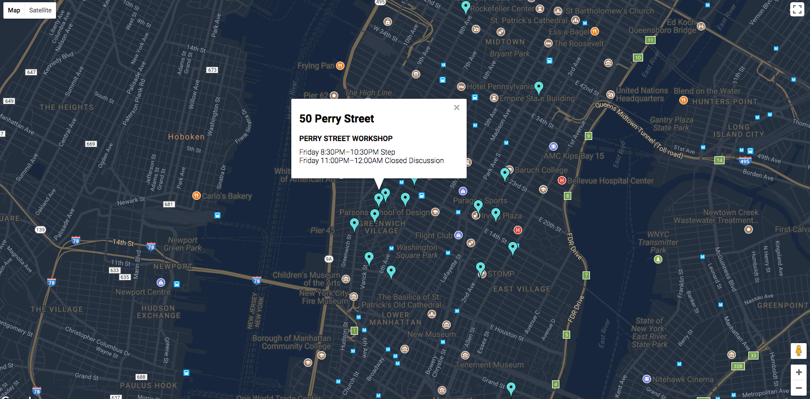

# Final Assignment 1: A map of Alcoholics Anonymous meetings in Manhattan

This project is a visualization of all Alcoholics Anonymous meetings taking place in Manhattan at any point between the hour that the request is made and 4am the following morning.
The justification for this time period is that someone seeking a meeting may want to know about all meetings occurring that day or late at night.

### The code is split into four parts:
* part1.js: Parse data that had previously been scraped from the Alcoholics Anonymous website and create a separate object for each individual meeting.
 This generated the file addresses.json, which was read into part2.js.
* part2.js: Use Google API to attach latitude and longitude coordinates to each object.
 This generated the file addressesWithLatLong.json, which was inserted into a Mongo database in part3.js.
* part3.js: Insert all 1206 individual meetings into a Mongo database collection.
* part4.s: Code to receive user requests, aggregate meetings based on day and time of request, and return map of relevant meetings.

The files part1.js and part2.js were run in Cloud9. The file part3.js to insert the collection was run on EC2.
The code in part4.js was combined with the code in part3.js of final assignment 2 to make combined.js, which is on EC2 with the two files of html code (html1.txt andhtml2.txt).
This combined code is located [here](https://github.com/julianhlange/data-structures/blob/master/final-assignment/combined.js).

### Screen capture on Friday, December 8th, at 7:12PM
