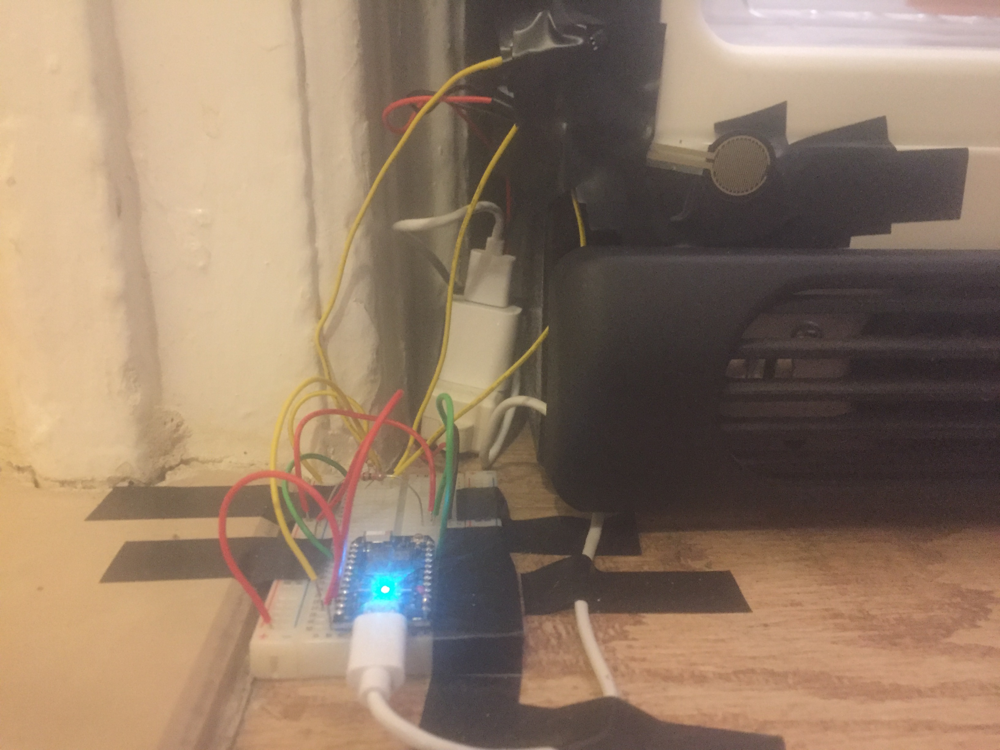

# Final Assignment 2: FridgeAWARE! Visualizing fridge events

This project is a visualization of data acquired from the measurements of two physical sensors connected to a Particle Photon device. 
With these measurements, I calculated the frequency of fridge door closing events at home.

### Two sensors
* Hall sensor: measures the presence or absence of a magnet and outputs a binary response
* FSR (force-sensitive resistor) sensor: measures physical pressure and outputs a value from 0 to >3000 that scales with the amount of pressure applied

### Photo of sensors fastened to the fridge

The Hall sensor is the small black device at the top and connecting to the Particle Photon via yellow wiring. The FSR sensor is the flat frying-pan-shaped device.
The cyan light on the Particle Photon indicates that it is "breathing," meaning that it is connected to the Internet.

### Specifics of how "closing frequency" was determined for each sensor
For the Hall device, I fastened the sensor to the bottom of the fridge frame and attached a magnet to the fridge door. When the door is open, the sensor
and magnet are separated; when the door is closed, the magnet is brought into proximity of the sensor.
For the FSR sensor, I fastened the sensor onto the gasket of the fridge frame. When the fridge door is open, there is no physical pressure on the sensor,
and readings are low (in the 0-20 range). Closing the door applies presses the door and applies physical pressure onto the sensor, and readings are high.
The sensor is read every 5 seconds. The fridge is in a "closed" position the vast majority of the time. Upon request, the final SQL code aggregates – for
each sensor – how often the fridge door *transitions* from an "open" position to a "closed" position each day. During testing and checkups, the Hall sensor
seemed very reliable. In contrast, the FSR sensor gave some inaccurate readings, so its data are a little dubious.

### The code is split into three parts
* part1.ino: Flashed from the Particle App interface to the Particle device.
* part2.js: Make request every 5 seconds to the Particle API to get sensor values, connect to AWS Postgres database, and insert values into sensor table.
* part3.js: Code to receive user requests and aggregate data for each day, as described above.

The file part1.ino was flashed from the Particle App interface to the device. The file part2.js is running on EC2. The code in file part3.js was combined with the code in part4.js of final assignment 1 to make combined.js, which is on EC2.

### Visualization
30 days' worth of data are plotted in a bar charts shown in the accompanying visualizations. See the documentation.txt file for implementation.

### Documentation for how sensor data connect to visual representation
Given the sensor data in hand, I am using fridge closings as a proxy for "fridge opening" events.
The PDF shows three layouts:
* LANDING page
* SENSOR 1 page: Bar chart of data collected with the Hall sensor
* SENSOR 2 page: Bar chart of data collected with the FSR sensor

The DEMO button on the Landing page would take the uer to the SENSOR 1 page.
The 30 most recent days (i.e., the 30 last entries) would show in the bar charts. The user would be able to switch between the SENSOR 1 and SENSOR 2 pages by clicking at the top right.

The following values would be pulled from the [aggregated data] (http://ec2-34-226-216-182.compute-1.amazonaws.com:3000/):
* date: supplies month and day on x axis
* fridgeclosed_hallsensor: supplies height of bars on Hall sensor page
* fridgeclosed_fsrsensor: supplies height of bars on FSR sensor page

The maximum height on each bar chart would be defined using a rounding function (on both data sets) to the next nearest ten.

Possible modifications could include zooming options and a tooltip on the bars so that the user could view values for each day.